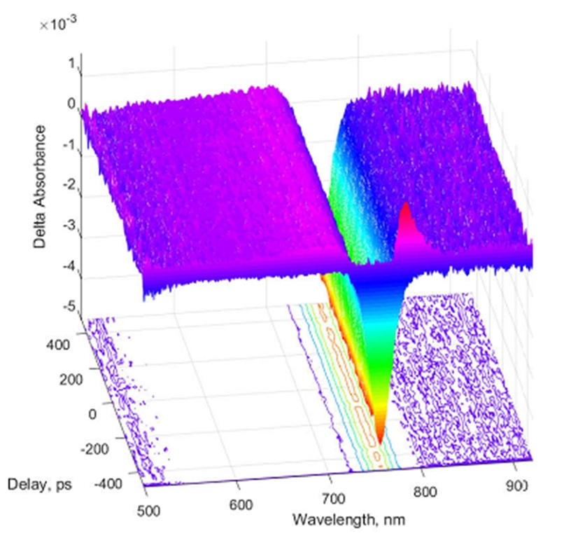

# FemtoTransAbs (Godzilla)
   
A real time transient absorption CCD spectrometer instrument control/data acquisition software written in C#  
You may use it under GPL 3.0 protocal
   
Some notes:   
1) This software currently only implements the BWTEK Exemplar LS CCD spectrometer (low level APIs are provided by BWTEK Inc.), will soon support SOL 1.7 IR CCD spectrometer. In future, it may support Ocean Optics CCD spectrometer.    
2) This software currently only supports mechanical delay stage from NewPort Inc. (I am not able to test other brands at the moment)  
3) This software uses some external sync signal to trigger the BWTEK CCD spectrometer, and it detects the instrument connection at the beginning.   
4) Make sure your laser system is a megahertz reptition rate (or at least tens of kilohertz reptition rate) system in order to obtain good signal-to-noise.   
5) other hardware required:    
   a) A optical chopper with sync signal output 
   b) A TTL frequency doubler that doubles the input TTL signal frequency, and will need to function in 10-2000 Hz range. (home-built diff op amp circuit will do) 
   c) ultrafast optics to do the transient absorption measurements (mechanical delay stage etc.) 

For any other questions, please email gzgzgz{\replace_with_at/}gmail.com
